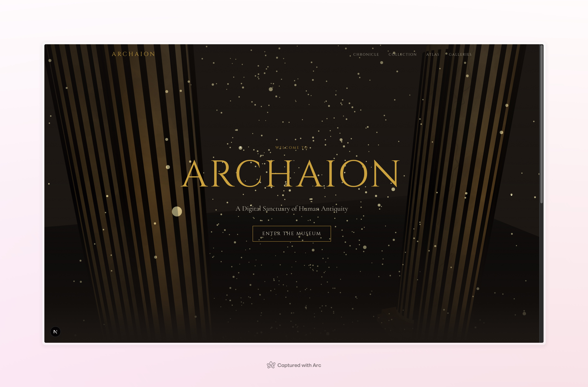
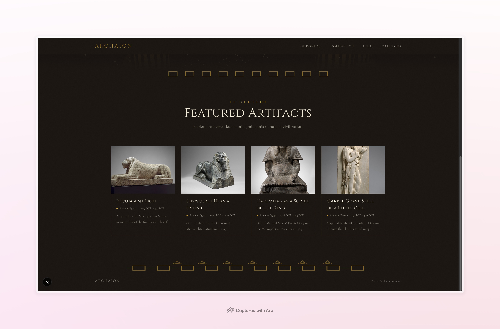
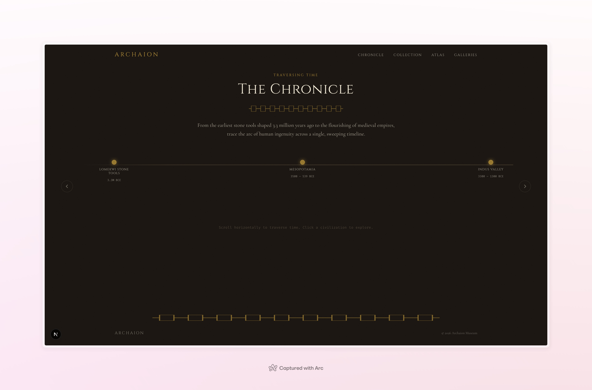
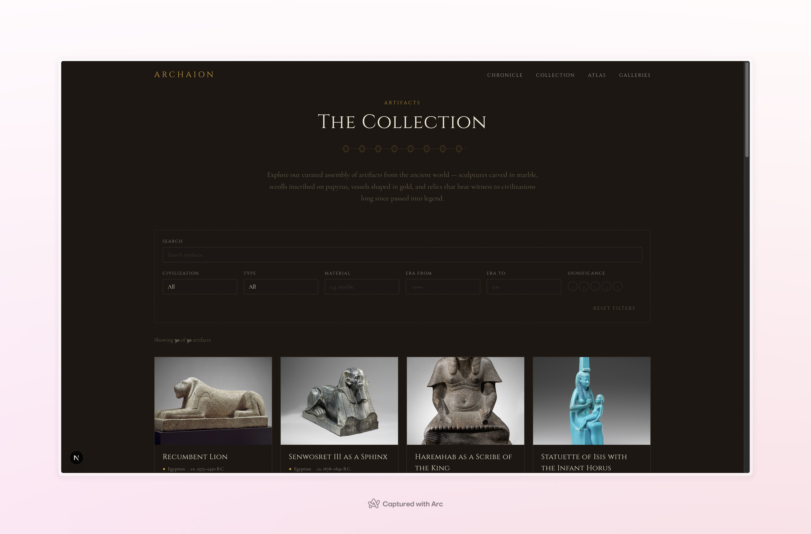
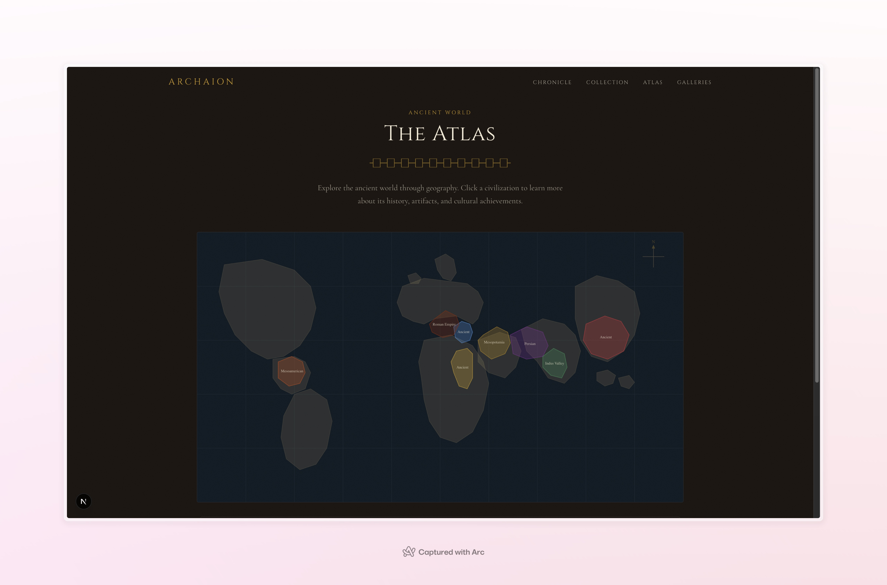
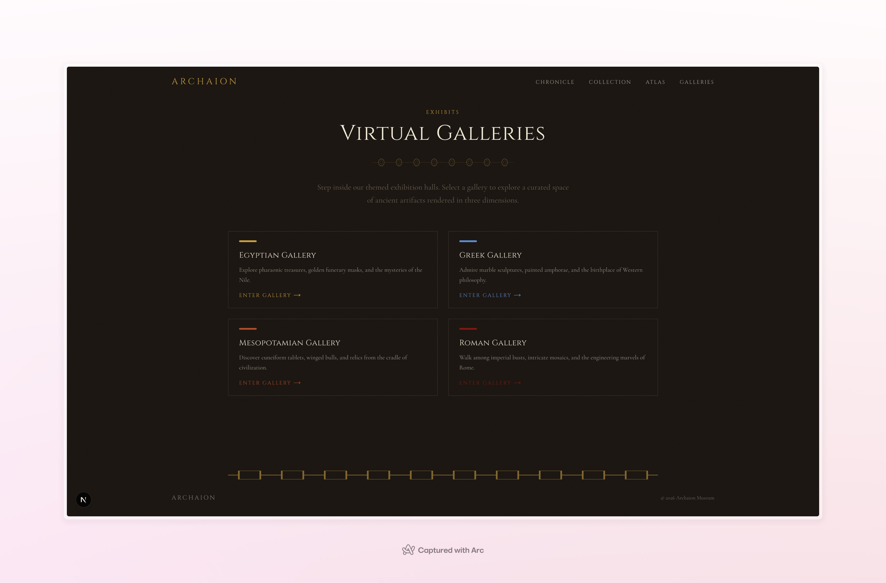

# Archaion — Digital Museum of the Ancient World

[](LICENSE)
[](https://nextjs.org)
[](https://www.typescriptlang.org)
[](https://react.dev)
[](https://threejs.org)
[](https://tailwindcss.com)

An immersive, interactive digital museum exploring human antiquity through 3D environments, real artifact photography, and rich historical narratives.

**Live features:** 3D WebGL entrance portal with procedurally-textured Greek Doric columns, horizontal timeline of civilizations, filterable artifact collection with Met Museum photographs, interactive SVG world atlas, virtual 3D gallery walkthroughs, and detailed artifact pages with provenance and scholarly notes.

## Screenshots

### Grand Entrance
3D portal with procedurally-textured Doric columns, gold particle effects, and ambient lighting.



### Featured Artifacts
Homepage showcase with real photographs from the Met Museum's Open Access collection.



### The Chronicle
Interactive horizontal timeline spanning 3.3 million years — from Lomekwi stone tools to the Islamic Golden Age.



### The Collection
Filterable artifact grid with search, civilization, type, era, material, and significance filters.



### The Atlas
Interactive SVG world map with dual-range era slider showing civilizations active in a given time period.



### Virtual Galleries
3D gallery rooms with themed exhibition halls for Egyptian, Greek, Mesopotamian, and Roman collections.



## One-Click Deploy

[](https://vercel.com/new/clone?repository-url=https%3A%2F%2Fgithub.com%2Fusmantahir27%2Fvirtual-museum)

Click the button above to clone and deploy this project to Vercel instantly. No configuration needed — the project includes all required settings.

Also deployed on GitHub Pages: [usmantahir27.github.io/virtual-museum](https://usmantahir27.github.io/virtual-museum/)

## About This Project

This is a hobby project built to test and explore the capabilities of Claude (Anthropic's AI) as a development partner. The entire codebase — from architecture decisions to procedural marble textures — was developed collaboratively with Claude to see how far AI-assisted development can go on an ambitious frontend project.

## Tech Stack

- **Framework:** Next.js 16 (App Router)
- **Language:** TypeScript (strict mode)
- **Styling:** Tailwind CSS v4
- **3D:** React Three Fiber + Three.js + @react-three/drei
- **Animation:** Framer Motion
- **React:** 19 (with React Compiler)
- **Node:** 22+ (pinned via `.nvmrc` and `vercel.json`)

## Getting Started

Requires Node.js 22+ (see `.nvmrc`).

```bash
npm install
npm run dev
```

Open [http://localhost:3000](http://localhost:3000).

## Pages

| Route | Description |
|-------|-------------|
| `/` | Grand Entrance — 3D portal with gold particles and Doric columns |
| `/collection` | Artifact grid with filtering by civilization, type, era, material |
| `/artifact/[slug]` | Artifact detail with real photographs, provenance, scholarly notes |
| `/chronicle` | Horizontal timeline spanning 3.3M years of human civilization |
| `/atlas` | Interactive SVG map with dual-range era slider |
| `/galleries` | Virtual 3D gallery rooms with fullscreen mode |

## Data

Currently uses local TypeScript mock data with real artifact metadata and photograph URLs from the Metropolitan Museum of Art's Open Access collection.

## Deployment

### Vercel (Recommended)

This project is pre-configured for Vercel. The `vercel.json` pins Node 22.x, and the build/install commands are standard Next.js defaults.

1. Click the deploy button above, **or**
2. Import the repo at [vercel.com/new](https://vercel.com/new) — no environment variables or custom settings required.

### GitHub Pages

Automatically deployed via GitHub Actions on every push to `main`. The workflow builds a static export with `GITHUB_PAGES=true` which enables `output: "export"` and sets the correct `basePath`.

### Other Platforms

```bash
npm run build   # produces .next/
npm start       # starts production server on port 3000
```

Ensure Node.js 22+ is available on the target platform.

## License

This project is licensed under the [MIT License](LICENSE) — use it however you want, for any purpose, no strings attached.
